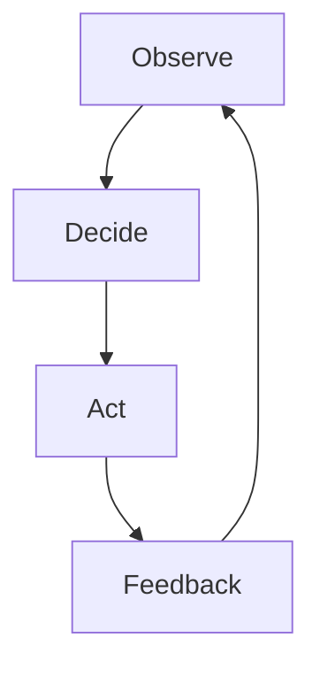

# Obsidian Vault Layout for Game Design

Recommended folder structure for storing a GDD in Obsidian, optimized for bidirectional linking, Mermaid flowcharts, and the GDD Toolkit workflow.

> This file lives at `gdd-toolkit/assets/obsidian-vault-layout.md` in the repo.

---

## Top-Level Structure

```
game-design/
├── 00 Vision Lock/             # Locked, rarely changed
│   ├── Elevator Pitch.md
│   ├── Design Pillars.md
│   ├── Target Audience.md
│   ├── Scope Budget.md
│   └── Constraints.md
│
├── 01 Core Loop/               # The foundation — everything traces here
│   ├── Core Loop.md            # Mermaid flowchart + annotated phases
│   ├── Secondary Loops.md
│   ├── Meta Loop.md
│   └── Pacing.md
│
├── 02 Features/                # One note per feature, passed through Pillar Gate
│   ├── Feature Index.md        # Dataview table of all features
│   ├── Movement.md
│   ├── Combat.md
│   ├── Inventory.md
│   ├── Crafting.md
│   └── ...                     # One file per feature
│
├── 03 Systems/                 # One note per system, following system-design template
│   ├── System Index.md         # Dataview table with interactions
│   ├── Economy.md
│   ├── Progression.md
│   ├── Enemy AI.md
│   └── ...
│
├── 04 Pairwise Matrix/         # The interaction analysis
│   ├── Matrix Overview.md      # The full N×N matrix table
│   ├── Pairs Jump+Attack.md    # Detailed analysis per pair
│   ├── Pairs Run+Shoot.md
│   └── ...
│
├── 05 Balance & Tuning/        # Numbers, curves, formulas
│   ├── Tuning Index.md
│   ├── Damage Curves.md
│   ├── Economy Tables.md
│   ├── Difficulty Scaling.md
│   └── ...
│
├── 06 Player Journey/          # The experience from the player's side
│   ├── Onboarding.md
│   ├── First Hour.md
│   ├── Midgame.md
│   ├── Endgame.md
│   └── Player Archetypes.md
│
├── 07 Narrative & World/       # Story-relevant design
│   ├── Setting.md
│   ├── Plot Outline.md
│   ├── Characters.md
│   ├── Narrative Mechanics.md
│   └── Writing Style.md
│
├── 08 Technical/               # Engineering-facing docs
│   ├── Platform Specs.md
│   ├── Performance Targets.md
│   ├── Asset Pipeline.md
│   └── State Machines/
│
├── 09 Production/              # Timeline, priorities, risks
│   ├── Timeline.md
│   ├── Feature Priority.md
│   ├── Risk Register.md
│   └── Playtest Schedule.md
│
├── 10 Design Reviews/          # Design Judge verdicts over time
│   ├── Review 2026-07-24.md
│   ├── Review 2026-08-01.md
│   └── ...
│
└── Templates/                  # Reusable page templates
    ├── t: Feature.md
    ├── t: System Design.md
    ├── t: Pairwise Analysis.md
    └── t: Design Review.md
```

---

## Linking Conventions

Use `[[wikilinks]]` obsessively. Every feature links to:
- The pillar(s) it serves: `[[Design Pillars#Pillar 1]]`
- The core loop phase it touches: `[[Core Loop#Act]]`
- Every system it interacts with: `[[Economy]]`
- Every pairwise analysis it participates in: `[[Pairs Jump+Attack]]`

---

## Dataview Queries

### Feature Index (put in `02 Features/Feature Index.md`)

```dataview
TABLE
  type as "Type",
  pillar as "Pillar",
  loop-phase as "Loop Phase",
  status as "Status"
FROM "02 Features"
WHERE type != "index"
SORT file.name ASC
```

### Recent Design Reviews

```dataview
TABLE
  result as "Verdict",
  file.cday as "Date"
FROM "10 Design Reviews"
SORT file.cday DESC
LIMIT 5
```

---

## Mermaid Usage in Obsidian

Mermaid blocks render natively in Obsidian. Use them inline with the doc:



For complex diagrams too large for inline, use Obsidian Canvas (`.canvas` files) and link them from the note.

---

## Frontmatter Convention

Every feature and system note should have YAML frontmatter:

```yaml
---
type: feature       # feature / system / pair / review
name: Wall Running
pillar: Acrobatic Combat
loop-phase: Act
status: draft       # draft / reviewed / locked / deprecated
scope-cost: 2
created: 2026-07-24
---
```

This enables Dataview queries and makes the vault queryable by an AI agent.
