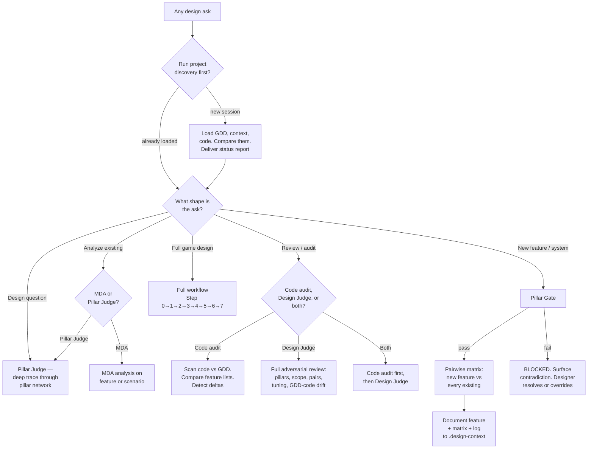
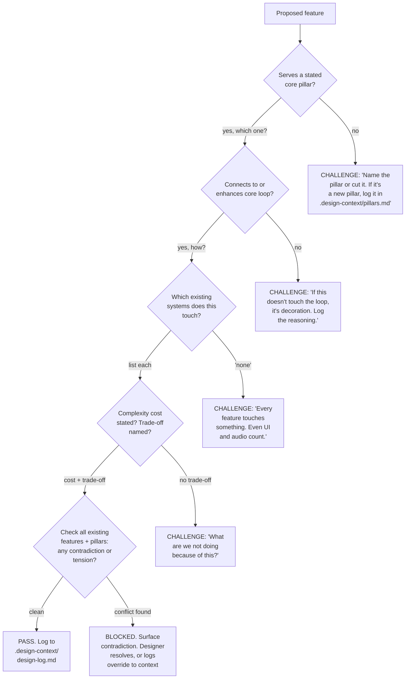
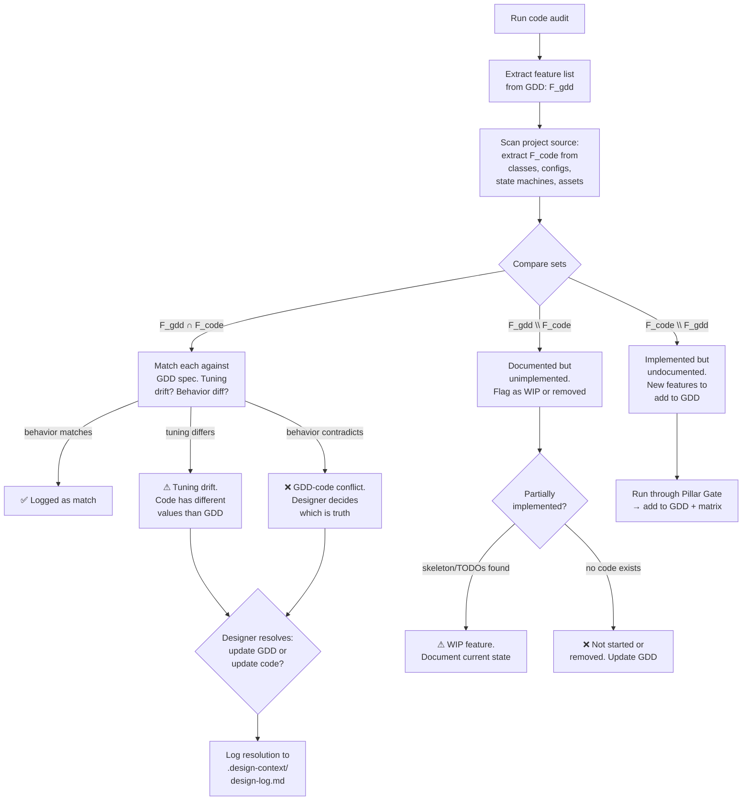
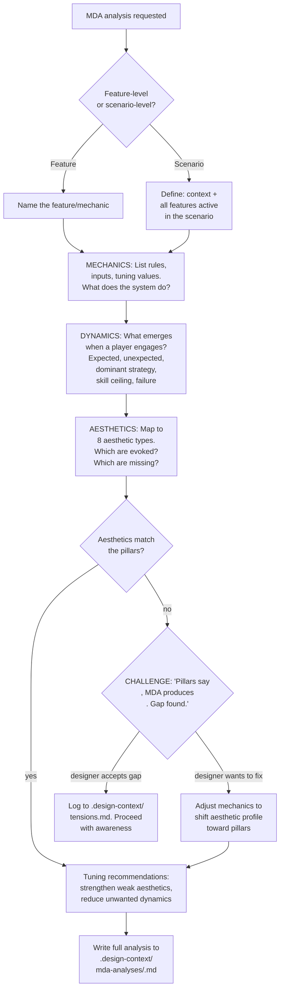
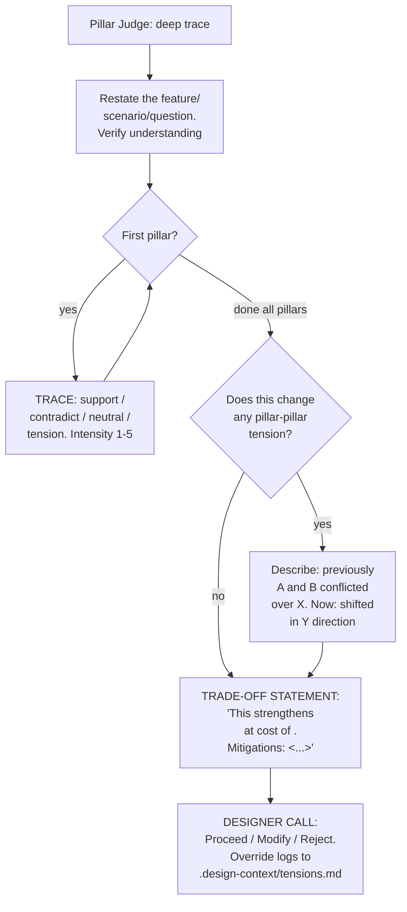
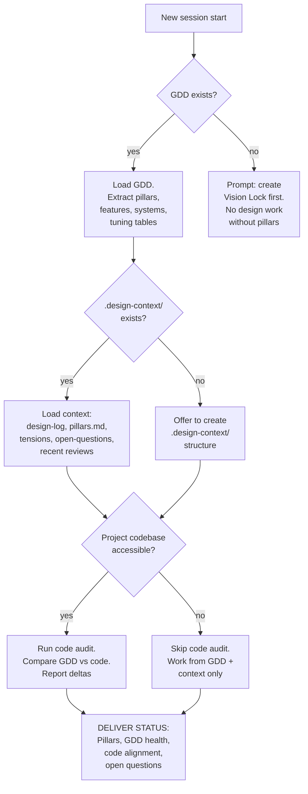

# The Game Design Workflow — as Flowcharts

Follow the arrows literally. Diamonds are decisions. Boxes name concrete artifacts.

## 1. The Master Router

## 2. The Pillar Gate

## 3. The Code Audit Flow

## 4. MDA Analysis Flow

## 5. The Pillar Judge

## 6. Project Discovery (Session Start)

## Reading these as a designer

Follow the arrows literally. When a box says CHALLENGE or BLOCKED, the agent must deliver that challenge — not soften it, not proceed silently. When a box says "log to .design-context/", the log entry must be written before proceeding to the next step.
