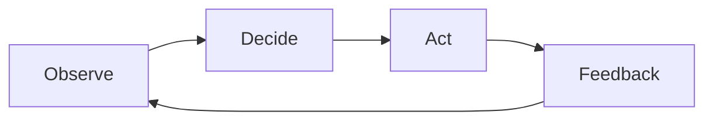

# GDD Skeleton — <Game Title>

> **Genre:** <primary / secondary>
> **Platform:** <target platforms>
> **Target Audience:** <age range, skill level, similar games played>
> **Status:** <Draft / Living / Frozen / Archived>
> **Last Updated:** <date>

---

## 1. Executive Summary

**Elevator Pitch:** <one paragraph>

**Unique Selling Points:**
- <what makes this game different>
- <what makes this game different>
- <what makes this game different>

**Comparable Titles:** <games that share audience or mechanics — not "X meets Y">

---

## 2. Design Pillars

```
Pillar 1: <name>
  What the player experiences: <observable statement>
  What this forbids: <design decisions this pillar rejects>
  How we verify this: <testable criteria>

Pillar 2: <name>
  ...

Pillar 3: <name>
  ...

Pillar 4: <name> (optional)
  ...

Pillar 5: <name> (optional — 5 max)
  ...
```

---

## 3. Core Loop



**Observe:** <what the player sees/hears that informs their decision>
**Decide:** <the interesting choice the player makes>
**Act:** <the input the player performs>
**Feedback:** <what the game communicates back>

**Secondary Loops:**
- <loop that feeds back into core>
- <loop that feeds back into core>

**Meta Loop (across sessions):**
- <progression, story, unlocks that persist>

**Pacing:**
- <how intensity varies within a session>

---

## 4. Player Journey

**First 5 Minutes:** <what the player sees, does, and learns>

**First 15 Minutes:** <how the game opens up>

**First Hour:** <first major milestone or system unlock>

**Midgame:** <how depth emerges, systems interplay>

**Endgame:** <what mastery looks like, post-content goals>

**Onboarding:**
- Tutorial approach: <diegetic / explicit / gradual / optional>
- New player friction points: <what might confuse first-time players>
- How the game teaches without telling: <show-don't-tell mechanics>

---

## 5. Feature Catalog

*Each feature passes through the Pillar Gate and Pairwise Matrix before being listed here.*

| # | Feature | Type | Pillar | Core Loop Phase | Status |
|---|---|---|---|---|---|
| 1 | <name> | Core / Secondary / Content | <pillar> | <phase> | ✅ / ⚠ / ❌ |
| 2 | <name> | Core / Secondary / Content | <pillar> | <phase> | ✅ / ⚠ / ❌ |
| ... | ... | ... | ... | ... | ... |

---

## 6. Systems Design

*One section per system, following the system design template. See references/templates/system-design.md*

### System: <name>

**Purpose:** <what this system does for the player>
**Core Loop Phase:** <which phase this touches>

**Inputs:**
- <input A>
- <input B>

**Process:**
- <rule or formula>
- <rule or formula>

**Outputs:**
- <output A>
- <output B>

**Interactions:**
- <System X>: <how they interact>
- <System Y>: <how they interact>

**Tuning Levers:**
- <lever>: <range>, <default>

**Edge Cases:**
- <edge case>
- <edge case>

---

## 7. Pairwise Interaction Matrix

*Full matrix: every feature against every other feature. See SKILL.md Step 3 for format.*

| | F1 | F2 | F3 | F4 |
|---|---|---|---|---|
| F1 | - | ✅ | ✅ | ⚠ |
| F2 | ✅ | - | ❌ | ✅ |
| F3 | ✅ | ❌ | - | ✅ |
| F4 | ⚠ | ✅ | ✅ | - |

---

## 8. Balance & Tuning

*Per-system tuning tables. Prose-only tuning is not accepted. See references/templates/balance-table.md*

---

## 9. Technical Requirements

**Platform Targets:** <specs per platform>
**Engine:** <engine + version>
**Performance Targets:** <resolution, framerate, load times>
**Memory Budgets:** <RAM, VRAM>
**Networking:** <architecture if applicable>
**Build Pipeline:** <tools, automation>

---

## 10. Production & Scope

**Team Size:** <number of people>
**Estimated Timeline:** <milestones>

**Scope Budget:**
- Total budget: <N> complexity points
- Spent: <N> pts
- Remaining: <N> pts

**Feature Priority:**
- Must-have: <features without which the game doesn't work>
- Should-have: <features that significantly improve the experience>
- Nice-to-have: <features added only if budget allows>

**Risk Register:**
| Risk | Likelihood | Impact | Mitigation |
|---|---|---|---|
| <risk> | High/Med/Low | High/Med/Low | <plan> |

---

## 11. Appendices

- <link to relevant prototypes, references, research>
- <link to mood boards, concept art>
- <link to competitor analysis>
