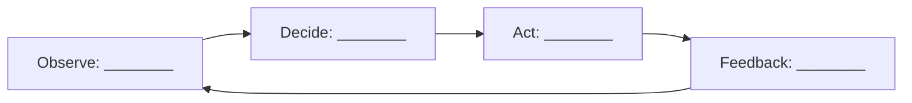
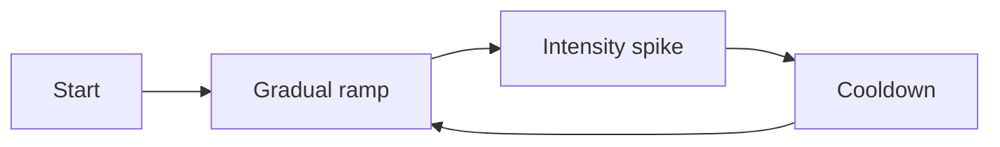

# Core Loop Canvas

A one-page worksheet for defining the game's fundamental loop.

---

## Game: <title>

### Core Loop (5-15 seconds)

| Phase | What happens | What the player thinks/feels |
|---|---|---|
| **Observe** | <what the player sees/hears that informs their action> | <the mental model they build> |
| **Decide** | <the interesting choice they face> | <the tension or consideration> |
| **Act** | <the physical input they perform> | <the satisfaction or cost of the action> |
| **Feedback** | <what the game communicates back> | <the reward, punishment, or new information> |

### Why is this loop fun?

<State the observable, testable reason. "It feels good" is not acceptable. Examples:
- "The player will attempt to chain actions unprompted within 3 attempts."
- "The player will correctly predict the outcome of their action within 2 tries."
- "The player will develop a preferred sequence within 5 minutes.">

### What makes this loop different from similar games?

<Name the specific difference in the loop itself, not in the setting or story.>

---

### Secondary Loops

| Loop | Connection to Core Loop |
|---|---|
| <name: description> | <how this feeds back into the core loop> |
| <name: description> | <how this feeds back into the core loop> |

### Meta Loop (Across Sessions)

| Progress Type | What Carries Over | What Resets |
|---|---|---|
| Player Skill | <skills the player learns> | <nothing or muscle memory decay> |
| Character Progression | <stats, gear, unlocks> | <items consumed, temporary buffs> |
| Narrative | <story state, choices made> | <nothing> |
| World State | <changes to the game world> | <respawns, resets> |

### Pacing Within a Session

- **How long is a typical session?** <minutes>
- **How does intensity vary?** <description of the tension arc>
- **What signals a natural stopping point?** <save point, quest complete, level cleared, resource depleted>

---

### Verification

**How will we know the core loop works before building the full game?**
- <Paper prototype test>
- <Digital prototype with placeholder art>
- <Player test with specific metrics>
- <Existing game mod that proves the concept>

**What metrics confirm the loop is working?**
- <Time to first mastery (player can perform loop without instruction)>
- <Loop repetition rate (how many times before boredom/exhaustion)>
- <Player-initiated variation (player tries different approaches within the loop)>
