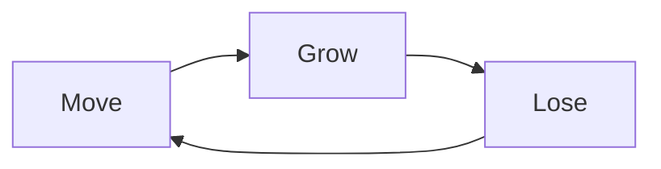

# Core Loop

## Loop (4 nodes)

## Prose

Player moves up, encounters bonds (grow), bonds sever (lose), moves again. Light/music swell on growth, shrink on loss. No fail, no score — state delta is the loop payload. Big NPC, color-change, flee, range-detach all feed into the Lose node. NPC attachment, call wave, attach chime, glow growth, music layer all feed into Grow.

## Encounter inputs

- **Move**: player ascends, camera ratchets, world scrolls down. Neutral state.
- **Grow**: matching-color NPC within call range → press O → call wave → attach. Glow radius + `glow_growth` per attach, music layer adds at att≥1/≥2/≥3, feedback ring + `sfx(51)` attach chime.
- **Lose**: Big NPC steal (cast ring warning, `steal_interval` cadence), color-change detach (`set_player_color` severs mismatches, `sfx(52)`), non-match NPC flee on contact, range-detach at `att_lose_range`. Glow shrinks via `att` recount, music layer drops.

## Pillar check

| Pillar | Pass | Note |
|---|---|---|
| P1 Always Move Forward | ✓ | Every branch returns to Move. No backtrack edge. Camera ratchets up only. |
| P2 Show, Don't Tell | ⚠ | All encounter types signal visually (call ring, attach ring+chime, Big cast ring, flower particles, flee despawn). **Flower "hold x" prompt = violation (T2/OQ3, deferred).** Fix pending. |
| P3 Emotion Is the Only Currency | ✓ | Loop payload = emotional state delta (growth/loss). No score, fail, win-metric, or session-stat node. Ending beat (OQ4) sits outside this loop as session wrapper. |

## Scope notes

- Loop is no explicit goal node — matches P3 + OQ2 (ending is narrative, not loop output).
- Big NPC + flower = rare encounter variants on Grow/Lose nodes. NPC matching = common.
- "Press O" / "hold X" phrasing is dev-facing. Player-facing = visual affordance (P2). Resolved with OQ3.

## Evolution

### 2026-07-24 — Initial loop locked
- **Set:** 4-node Move → Grow → Lose → Move.
- **Process:** First draft was a 13-node encounter graph (branch per encounter type). User rejected as too long, supplied 4-node reduction. Encounters collapsed into Grow/Lose inputs under the 4 nodes.
- **Rationale:** Core loop is the 5-15s heartbeat, not an exhaustive state graph. Encounter variants are tunable content inside Grow/Lose, not separate loop nodes. Tighter loop = clearer pillar fit and easier tuning.
- **Tensions:** T2 (flower prompt) carries forward. P1↔P3 (loss unrecoverable, OQ1) carries forward.