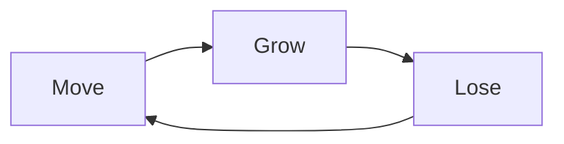

# GDD — loneliness

> **Genre:** narrative / meditative ascent
> **Platform:** PICO-8 (native + web export via `.html`/`.js`)
> **Target Audience:** players of short emotional indie works (Cart Life, Glitchhikers, Bernband); PICO-8 community; jam audience
> **Status:** Draft
> **Last Updated:** 2026-07-24

---

## 1. Executive Summary

**Elevator Pitch:**

A meditation on irreversible attachment. You ascend a corridor without destination, calling to color-matched spirits who orbit your light and swell your music. A larger shadow casts a warning ring and takes them from you. Flowers offer new identities at the cost of severing your old bonds. The world scrolls down, pollen parts around you, and you cannot go back. The session ends when the story ends.

**Unique Selling Points:**

- Emotion is the only metric — no score, no fail, no win-condition number. Growth and loss are read in light radius and musical density.
- Show-don't-tell enforced inside gameplay: no tutorial text, no button prompts (one known violation, deferred), no instruction. The world teaches by reacting.
- Ascent is literal and irreversible — the camera ratchets upward, bonds sever beyond reach, and the world that produced the player falls away permanently.

**Comparable Titles:**

Bernband, Glitchhikers, Cart Life (audience + tone); A Short Hike (ascent + non-violent loop); Outer Wilds (knowledge as currency instead of score).

---

## 2. Design Pillars

```
P1 — Always Move Forward
  Statement: The player only moves forward; there is no going back.
  What this enables: Infinite procedural ascent, no map data, parallax pollen/grass, ratchet camera, irreversible progress.
  What this forbids: Backtracking, lateral exploration, downward camera, grounded level layouts, do-overs for lost bonds.
  How we verify: cam_y only decreases (ratchet); bottom clamp blocks downward motion; no __map__ reload; no reset of attached/detached NPC state on retreat.

P2 — Show, Don't Tell
  Statement: Never tell the player what to do; use UX, visual affordance, and gameplay behavior to guide the player through.
  What this enables: Color matching read from NPC appearance, orbit feedback on attach, call-wave visual, Big NPC cast ring as warning, flower visual distinction (sprite 9 vs 10).
  What this forbids: Tutorial text in gameplay, button prompts, hint arrows, spoken instruction, system messages.
  How we verify: No print(...) instruction during state=="play"; any on-screen text is diegetic flavor only (intro screen is pre-play).

P3 — Emotion Is the Only Currency
  Statement: Emotion is the only currency — no score, no fail state, no progression metric competes with how the player feels.
  What this enables: Growth-as-bond (light/glow/music scale with att), loss-as-grief (Big steal / detach / range-lose), identity shift (color change severs mismatched bonds), ascent-as-distance-without-destination.
  What this forbids: Score counter, leaderboard, fail/game-over screen, win-condition metric, XP/level, achievements, session statistics, completion percentage.
  How we verify: No score= global; no state=="gameover"; att feed goes to glow/music only, never a displayed stat; ending (when added) triggers on narrative beat, not score threshold.
```

Full pillar history: `.design-context/pillars.md`

---

## 3. Core Loop



**Move:** Player ascends. Camera ratchets, world scrolls downward, pollen/grass parallax. Neutral input phase.

**Grow:** Player presses O near a color-matching NPC. Call wave attaches it. Glow radius swells (`g*b + att*glow_growth`), music layer adds at `att≥1/2/3`, feedback ring + attach chime.

**Lose:** Bonds sever — Big NPC steals (cast ring warning, steal cadence), color-change detaches mismatches, non-match NPCs flee on contact, attached NPCs drift free beyond `att_lose_range`. Glow shrinks via `att` recount, music layer drops, detach chime `sfx(52)`.

**Loop payload:** Emotional state delta — growth, then loss, then movement into the next encounter. No goal node.

**Secondary Loops:**

- Identity loop (flower): hold X 3s → color change → mismatched attached flee + new matching NPCs attractable on next call. Discrete decision events, finite per session.
- Ambient loop (pollen): world reacts to player presence + Big cast + flower burst. Pure visual, no state feedback.

**Meta Loop:**

- Single session narrative arc → ending beat (design TBD, OQ4). No cross-session progression.

**Pacing:**

- Rarity: NPC matching = common; Big + flower = rare. Common grows, rare losses/shifts punctuate.
- Intensity curve defined by placement in `level_editor.html` (Big/flower spawn density along the ascent).

Full loop history: `.design-context/core-loop.md`

---

## 4. Player Journey

**First 5 Minutes:**

Splash (2s, no skip) → intro typewriter "ほたる" + hold + fade → dithered fade-in reveals play. Player wakes in corridor with white glow (`pcol=6`), sees one matching NPC within reach, no instruction. Pressing movement buttons the player learns they ascend. Experimentation with O produces a call wave and the first attach — glow widens, music adds a pad layer, attach chime. The player understands the bond verb immediately through visual response.

**First 15 Minutes:**

Two-three matching NPCs orbit. A non-matching NPC enters view; contact makes it flee. Big NPC enters at y=-260 area, casts a warning ring; steals one bond; retreats. Player feels loss: glow shrinks, music layer drops, detach chime. Recovery via next call-wave attach. First flower encountered near y=-27 (default level): hold X 3s, color shifts, mismatched bonds flee, color-burst ring scatters pollen, new color's NPCs attractable.

**First Hour:**

Player has cycled through colors, learned Big's behavior, learned color-change cost. Approaches the ending beat (TBD). In current scope without ending, player hits content boundary (no more spawns above).

**Midgame / Endgame:**

Single-session design — midgame and endgame collapse into the arc to the ending beat. Mastery = recognizing the cost of color changes,Recognizing Big's warning ring and accepting or sacrificing a bond, recognizing when no new bonds are available and the world will only scroll.

**Onboarding:**

- Tutorial approach: pure diegetic / show-don't-tell. No tutorial text in play.
- Known friction points: call wave verb may be undiscovered if player doesn't press O near a matching NPC. Flower "hold x" prompt is an explicit tell and a known P2 violation (T2/OQ3, deferred).
- How the game teaches: color matching via NPC color + player's own glow color. Attach via call ring + NPC snapping to orbit + chime. Flee via NPC despawn.

---

## 5. Feature Catalog

| # | Feature | Type | Pillar | Core Loop Phase | Status |
|---|---|---|---|---|---|
| 1 | Player Movement + Ratchet Camera | Core | P1/P2/P3 | Move | ✅ |
| 2 | Color-Matched NPC Attach (Call Wave) | Core | P1/P2/P3 | Grow + Lose | ⚠ — missing overflow guard |
| 3 | Big NPC Thief | Core | P1/P2/P3 | Lose | ⚠ — idle drift TBD, Flag 3 deferred |
| 4 | Flower Color-Change | Core | P1/P2/P3 | Grow + Lose | ⚠ — mis-input guard TBD, prompt P2 violation deferred |
| 5 | Pollen Ambient | Secondary | P2/P3 | (atmosphere) | ⚠ — 3 overflow paths |
| 6 | Dynamic Soundtrack | Secondary | P2/P3 | (display) | ⚠ — musical ceiling vs unbounded glow |
| 7 | Grass & Flower Visual | Content | P1/P2/P3 | (atmosphere) | ⚠ — hardcoded grass removal TBD |
| 8 | Splash + Intro + Fade-In | Content | P1/P2/P3 | (pre-play) | ✅ |

Status legend: ✅ locked / ⚠ flag open / ❌ blocked.

---

## 6. Systems Design

*Full design for each: `.design-context/systems/NN-*.md`*

### System 1 — Player Movement + Ratchet Camera

**Purpose:** Player moves freely in 2D within invisible corridor bounds; camera ratchets upward only. Enforces P1 literally — the axle of the Move node.

**Core Loop Phase:** Move (is the Move node)

**Inputs:**

- `btn(0..3)` held directions
- `spd` tunable (default 1 px/frame)
- `px, py, cam_y` runtime state

**Process:**

```
if btn(0) then px-=spd end
if btn(1) then px+=spd end
if btn(2) then py-=spd end
if btn(3) then py+=spd end
update_camera()

-- update_camera:
local sy = py - cam_y
if sy < cam_dead then cam_y -= (cam_dead - sy) end   -- ratchet up only
if py > cam_y + 120 then py = cam_y + 120 end         -- bottom clamp (no regress)
px = mid(corridor_l, px, corridor_r)
```

All entities draw via `world_y - cam_y` parallax transform.

**Outputs:**

- `px, py` for every entity using world coords
- `cam_y` for every entity draw transform — monotonically decreasing

**Interactions:**

- Every entity draw path reads `cam_y`
- Pollen wrap band keyed to `cam_y`
- Big/NPC despawn bounds use `cam_y + 144`

**Tuning Levers:**

- `spd`: 0.5–2, default 1
- `cam_dead`: 16–96, default 60
- `corridor_l`: 0–60, default 0
- `corridor_r`: 68–120, default 120

**Edge Cases:**

- Spawn frame: `py=84` vs `cam_dead=60` → 36px downward slack before bottom clamp engages (local nav, not world regress; P1 satisfied at world scale)
- Hold Down: `py` clamps at `cam_y + 120`, no fail
- Invisible walls (no visual on `corridor_l/r`) — player learns by bonking (P2-adjacent but not violation; bonk IS feedback)

---

### System 2 — Color-Matched NPC Attach (Call Wave)

**Purpose:** Player's verb for gaining bonds. Press O → expanding wave; matching-color NPCs attach (Grow), non-matching flee (Lose).

**Core Loop Phase:** Grow (attach) + Lose (flee input)

**Inputs:**

- `btnp(4)` (O button) trigger
- `call.cd, call.active` state
- `pcol, n.col` color gate
- `n.att, n.stolen, n.fleeing` entity state

**Process:**

```
if call.cd > 0 then call.cd -= 1 end
if btnp(4) and not call.active and call.cd <= 0 then
  call.active = true; call.r = 0; call.hit = {}
end
if call.active then
  call.r += call_speed
  for n in all(npcs):
    if not n.stolen and not call.hit[n]:
      local d = dist(player, n)
      if d <= call.r:
        call.hit[n] = true
        if n.col == pcol:
          if not n.att:
            n.att = true; n.att_fc = fc; big.sc = 0
            add(rings, {r=8, a=12}); sfx(51)
            recount att; set_music_layers(att)
        elseif not n.fleeing and d > 0.001:
          n.fleeing = true; set n.fdx, n.fdy (straight-up avoided); sfx(52)
  if call.r >= call_max_r:
    call.active = false; call.cd = call_cd

-- orbit + range-detach (always):
if n.att:
  if dist(player, n) > att_lose_range:
    n.att = false; recount att; set_music_layers(att)
  else:
    slot = px + cos(fc*0.008 + (oi-1)/norbit)*16, py + sin(...)*16
    lerp n toward slot at att_sp, clamped to att_max
```

**Outputs:**

- `n.att=true` per attached NPC
- `att` count feeds glow radii + music layers
- `sfx(51)` / `sfx(52)`
- Feedback ring on attach

**Interactions:**

- Reads `px, py, cam_y` from Movement system
- Writes `big.sc=0` to Big system (resets steal cadence on fresh attach)
- Big read: steals `n.att and not n.stolen and fc-n.att_fc > steal_grace`
- Writes `rings` for Feedback Rings
- Calls `set_music_layers` for Soundtrack

**Tuning Levers:**

- `call_speed`: 1–4, default 2
- `call_max_r`: 30–100, default 50 (must be < `att_lose_range`)
- `call_cd`: 0–90, default 30
- `att_sp`: 0.02–0.3, default 0.08
- `att_max`: 0.5–3, default 1.5
- `att_lose_range`: 60–128, default 90
- `flee_range`: 16–48, default 24
- `flee_sp`: 0.8–2.5, default 1.4
- `glow_growth`: 2–8, default 4

**Edge Cases / Flags:**

- Missing fixed-point overflow guard in distance check (same bug class as Big/flower fixes). **Code change TBD.**
- Latent `norbit=0` div-by-zero in slot angle math (currently masked by branching). Document only.

---

### System 3 — Big NPC Thief

**Purpose:** Primary Lose agent. 2×2 NPC that casts warning ring, steals attached bonds one at a time, retreats with horizontal bias. Only involuntary loss source besides color-change.

**Core Loop Phase:** Lose

**Inputs:**

- `big.x, big.y, big.done, big.retreat, big.cast, big.cast_t, big.sc, big.post_steal, big.fdx, big.fdy, big.jx, big.jy`
- `n.att, n.att_fc, n.stolen` per NPC
- `px, py, fc, cam_y`

**Process:**

```
if not big.done:
  local bdy = big.y - cam_y
  local big_onscreen = bdy > -16 and bdy < 144
  if not big.retreat:
    if big_onscreen:
      -- player proximity triggers cast
      local pdx, pdy = px-big.x, py-big.y
      if abs(pdx) < steal_range and abs(pdy) < steal_range   -- overflow guard
         and sqrt(pdx*pdx+pdy*pdy) < steal_range:
        if not big.cast:
          big.cast = true; big.cast_t = 36
          add(rings, {r=8, a=36, vg=4.5, x=big.x+8, y=(big.y-cam_y)+8})
      if big.cast:
        if big.cast_t > 0: big.cast_t -= 1
        else:
          big.sc += 1
          if big.sc >= steal_interval:
            big.sc = 0
            for n in all(npcs):
              if n.att and not n.stolen and fc-(n.att_fc or 0) > steal_grace:
                n.att = false; n.stolen = true; sfx(52)
                recount att; set_music_layers(att)
                break    -- one per cadence tick
    -- retreat trigger when cast done and no targets left
    if big.cast and big.cast_t <= 0 and att == 0 and not big.post_steal:
      big.post_steal = 15
    if big.post_steal:
      big.post_steal -= 1
      if big.post_steal <= 0:
        big.retreat = true
        -- horiz-biased away-from-player dir, no straight-up
        fy *= 0.2; renormalize; set big.fdx, big.fdy
  else:
    big.x += big.fdx * big_retreat_sp
    big.y += big.fdy * big_retreat_sp
    if big.y-cam_y > 144 or big.x < -16 or big.x > 144: big.done = true
-- stolen NPCs orbit Big (in main NPC loop):
if n.stolen:
  a = fc*0.008 + si/scount
  slot = big.x + cos(a)*16, big.y + sin(a)*16
  lerp n at 0.05
  if big.done: del(npcs, n)
```

**Outputs:**

- `n.stolen=true` per stolen NPC (excluded from player orbit, `att` recount, Big steal search)
- `att` decrement → glow shrink + music layer drop
- `sfx(52)` per steal
- Cast ring (own position + `vg=4.5` expansion speed)
- `big.done=true` triggers stolen NPC garbage collection

**Interactions:**

- Reads player position for proximity trigger
- Reads `n.att, n.att_fc, n.stolen` from Call Wave entities
- Writes `n.stolen=true` (consumed by NPC orbit branch)
- Pushes pollen during cast
- Calls `set_music_layers(att)` after each steal

**Tuning Levers:**

- `steal_range`: 32–96, default 56
- `steal_interval`: 8–30, default 15
- `steal_grace`: 30–120, default 60
- `big_retreat_sp`: 0.2–1.0, default 0.3
- `bg0/bg1/bg2`: 16/12/8 to 48/36/24, default 32/26/20 (own glow, not linked to player)
- `post_steal` (hardcoded): 8–30, default 15 — flag to expose
- `cast_t` (hardcoded): 24–60, default 36 — flag to expose
- `big_idle_drift` (proposed, **TBD**): horizontal drift toward nearest side wall when onscreen but unengaged — prevents player from skirting `steal_range` to keep Big idle forever

**Edge Cases / Flags:**

- Player enters `steal_range` with `att=0` → cast fires, completes, post-steal starts immediately, retreat. No steals, Big wastes cast.
- Cast may continue if Big goes offscreen mid-cast (minor bug, deferred per user "wait and see").
- Big idle forever if player skirts range — resolved by proposed `big_idle_drift` (TBD code).
- Overflow guard already present (prior bug fix).

---

### System 4 — Flower Color-Change

**Purpose:** Player's identity-shift action. Hold X 3s near unused flower → player glow color changes. Mismatched attached NPCs sever and flee. New color's NPCs become attractable. Finite, single-use per flower, world-space.

**Core Loop Phase:** Grow + Lose (decision node between loop phases)

**Inputs:**

- `btn(5)` (X button) held
- `px, py, cam_y`
- `f.x, f.y, f.col, f.used, f.charge` per flower
- `flower_absorb_r, flower_charge` tunables
- `pcol` (no-op guard)

**Process:**

```
local flower_charging = false
for f in all(flowers):
  if not f.used:
    local fdx, fdy = px-f.x, py-f.y
    if abs(fdx) < flower_absorb_r and abs(fdy) < flower_absorb_r and btn(5):
      local fd = sqrt(fdx*fdx + fdy*fdy)   -- overflow guarded
      if fd < flower_absorb_r:
        flower_charging = true
        f.charge = (f.charge or 0) + 1
        if f.charge >= flower_charge:
          f.charge = 0
          -- TBD mis-input guard: skip if f.col == pcol
          f.used = true
          set_player_color(f.col)
          add(rings, {r=8, a=36, vg=6, x=px+4, y=(py-cam_y)+4, col=f.col, burst=true})
      else:
        f.charge = 0
    else:
      f.charge = 0

if not flower_charging:
  -- player movement proceeds (system 1)

-- set_player_color(c):
if c == pcol: return
pcol = c; pcol2 = glow_cols[c] or c
for n in all(npcs):
  if n.col == c: n.fleeing = false
  elseif n.att and not n.stolen and n.col != c:
    n.att = false; n.fleeing = true
    set n.fdx, n.fdy (straight-up avoided); sfx(52)
recount att; set_music_layers(att)
```

**Outputs:**

- `pcol, pcol2` new player glow colors
- `n.att=false, n.fleeing=true` per mismatched attached
- `att` recount → glow shrink + music drop
- `sfx(52)` per detached NPC
- Burst ring (own position + `vg=6` + `col=f.col` + `burst=true` flag for pollen push)
- `f.used=true` for sprite 9→10 + interaction gate
- `flower_charging` (local) gates player movement this frame

**Interactions:**

- Writes `pcol` → re-routes Call Wave color gate (tightest coupling in cart)
- Big: if detach drives `att==0` mid-Big-cast, Big post-steal starts early (likely benign)
- Freezes Player Movement during charge
- Burst ring pushes Pollen (`flower_burst_s=8` strength) → pollen despawn → deficit respawn
- Calls `set_music_layers` on detach recount

**Tuning Levers:**

- `flower_charge`: 30–180, default 90 (3s @ 30fps)
- `flower_absorb_r`: 30–80, default 50
- `flower_particles`: 4–16, default 8 (idle orbit density)
- `flower_orbit_r`: 6–20, default 10
- `flower_burst_s`: 4–16, default 8
- `flower_burst_r`, `flower_radius` declared but unused — **dead tunables, candidate for deletion**

**Edge Cases / Flags:**

- "hold x" print prompt (loneliness.p8:519) — direct P2 violation, deferred (T2/OQ3)
- Big-near-flower dual-risk (3s freeze in `steal_range`) — resolved via level-editor placement discipline (no flower within `steal_range=56` of any Big spawn); editor validation TBD (OQ8)
- Mis-input no-op (`f.col == pcol`) consumes flower — resolved: add guard, skip `f.used=true` + burst, reset `f.charge=0`. **Code change TBD (OQ6).**

---

### System 5 — Pollen Ambient

**Purpose:** 60 ambient particles drift through world, repelled by player, pushed by Big cast, scattered by flower burst. Visual air of the game — gives motion to the void, dramatizes the two loudest beats. No state, no score, no loop edge.

**Core Loop Phase:** None — atmosphere (exists because P3 demands world react to player)

**Inputs:**

- `p.x, p.y, p.vx, p.vy, p.p, p.burst` per particle
- `px, py, cam_y` (player + camera)
- `pollen_rep_r, pollen_rep_s` tunables
- `big.cast, big.cast_t, big.x, big.y, big.done`
- `rings` with `r.burst=true` flag

**Process:**

```
for p in all(pollen):
  -- 1. player repulsion (linear falloff)
  dx, dy = p.x-px, p.y-py; d = sqrt(dx*dx + dy*dy)
  if d < pollen_rep_r and d > 0.001:
    f = (pollen_rep_r - d) / pollen_rep_r * pollen_rep_s
    p.x += dx/d * f; p.y += dy/d * f

  -- 2. Big cast ring push (during cast_t countdown)
  if big.cast and not big.done:
    bdx, bdy = p.x-big.x, p.y-big.y
    br = 36 - big.cast_t
    if br > -16:
      bd = sqrt(bdx*bdx + bdy*bdy); reach = br + 16
      if bd < reach and bd > 0.001:
        f = (reach - bd) / reach * 6   -- hardcoded strength
        p.x += bdx/bd * f; p.y += bdy/bd * f

  -- 3. flower burst ring push
  for r in all(rings):
    if r.burst:
      rdx, rdy = p.x-px, p.y-py
      rd = sqrt(rdx*rdx + rdy*rdy)
      if rd < r.r + 8 and rd > 0.001:
        f = (r.r + 8 - rd) / (r.r + 8) * flower_burst_s
        p.x += rdx/rd * f; p.y += rdy/rd * f
        p.burst = true

  -- 4. drift + wrap/despawn
  p.x += p.vx; p.y += p.vy
  if p.burst:
    if off-screen: del(pollen, p); pollen_deficit += 1
  else:
    wrap in world band ±160 around cam_y

-- 5. slow respawn
if pollen_deficit > 0:
  pollen_cd += 1
  if pollen_cd >= pollen_respawn_cd:
    add(pollen, {x=rnd(128), y=cam_y+rnd(128), ...})
    pollen_deficit -= 1

-- draw (last, on top):
for p in all(pollen): circfill(p.x, p.y-cam_y, p.p, 15)
```

**Outputs:**

- Screen pixels (col 15, radius `p.p ∈ [0.5, 1.5]`)
- `pollen_deficit` counter (drives respawn)

**Interactions:**

- Reads player + camera for repulse + parallax
- Reads Big state for cast push
- Reads `rings[].burst` for burst push (recipient only)
- No system reads pollen state — terminal draw sink

**Tuning Levers:**

- `pollen_n`: 20–120, default 60
- `pollen_rep_r`: 16–64, default 30
- `pollen_rep_s`: 0.5–3, default 1
- `pollen_respawn_cd`: 4–20, default 8
- Big cast push strength `6` (hardcoded) — flag to expose
- Drift velocity inline, not tunable — flag for tuning phase

**Edge Cases / Flags:**

- 3 fixed-point overflow paths (repulse / Big cast / burst) — all world-space deltas could exceed 181px. **Flag: same bug class as already-fixed Big/flower. Code change TBD.**
- Burst particle can stay onscreen with `p.burst=true` indefinitely if player ratchets past — cosmetic, low priority.

---

### System 6 — Dynamic Soundtrack

**Purpose:** Audible mirror of attachment. Bass alone at start. Pad joins at att≥1. Melody at att≥2. Shimmer at att≥3. Layers drop as bonds sever. The only displayed form of `att` — felt, not counted.

**Core Loop Phase:** None — passive display of `att`

**Inputs:**

- `att` (recounted at every change by Call Wave / Big / Flower)
- `snd_patterns` tunable
- State transition `intro → play`

**Process:**

```
function set_music_layers(att):
  for p = 0, snd_patterns-1:
    local base = 0x3100 + p*4    -- PICO-8 music pattern channel bytes
    for ch = 1, 3:                -- ch1 pad, ch2 mel, ch3 shimmer; ch0 bass always on
      local b = peek(base + ch)
      if att >= ch:
        poke(base + ch, band(b, 0xbf))   -- clear bit 6 → audible
      else:
        poke(base + ch, bor(b, 0x40))    -- set bit 6 → "empty" → skipped

-- intro → play:
set_music_layers(0); music(0, 1)   -- start pattern 0, loop mode; bass only

-- SFX slots: 50 splash sting, 51 attach chime, 52 detach chime
-- Whole-tone scale (C D E F# G# A#) across all SFX (authoring discipline)
```

PICO-8's native music engine skips channels marked empty — same mechanism as the editor channel toggle. Bit 6 toggle = seamless layer add/remove at pattern boundary, no restart.

**Outputs:**

- Audible musical layers (ch0–ch3)
- 3 SFX slot one-shots

**Interactions:**

- Reads `att` writes from Call Wave / Big / Flower (calls `set_music_layers` after each recount)
- Reads state transitions for music start
- No system reads soundtrack state — terminal audio sink

**Tuning Levers:**

- `snd_patterns`: 4–8, default 8 (must match composed `__music__` data)
- Layer threshold `att>=ch` (hardcoded in body) — flag to expose in tuning phase
- Pattern content composed in PICO-8 music editor, not code-tunable

**Edge Cases / Flags:**

- `att > 3` saturates at 4 layers — no ch4. Glow continues growing visibly past att=3 but music stops adding. **Design tension (deferred to judge / Balance & Tuning): musical ceiling vs unbounded glow.**
- Re-calling `music(0,1)` restarts pattern at row 0 (prior failed approach, documented) — never re-call. Use `set_music_layers` pokes only.
- SFX slot collision discipline (don't use slots 50–52 as music pattern notes) — authoring rule, not enforced.

---

### System 7 — Grass & Flower Visual Flourish

**Purpose:** Static world dressing. Grass tufts anchor each NPC plant cluster visually; flowers share the two-pass draw pattern. With pollen parallax, drives the felt sense of upward motion.

**Core Loop Phase:** None — atmosphere (exists because P1 requires *felt* motion)

**Inputs:**

- `grass` table (per-plant entries, world coords)
- `g.x, g.y` per tuft
- `cam_y` for draw transform + cull
- `npc_fillp` (shared dither pattern)

**Process:**

```
-- init: grass derives from plant table (per-plant, not per-NPC)
-- Code change TBD: remove hardcoded grass[1..4] in tab 1,
-- derive from plant table at init via: grass[i] = {x=p.x+12, y=p.y}

-- _draw pass 1 (before player glow): grass shadows
for g in all(grass):
  local sy = g.y - cam_y
  if sy > -8 and sy < 136:
    fillp(npc_fillp); circfill(g.x+4, sy+6, 5, 2); fillp(0)

-- _draw pass 2 (after glow + rings): grass sprites
for g in all(grass):
  local sy = g.y - cam_y
  if sy > -8 and sy < 136:
    spr(7, g.x, sy)
```

Flower visual follows same two-pass pattern: shadow under glow, sprite 9 (vibrant) / 10 (used) + colored idle orbit particles over glow. Charge particles + accumulation particles + burst ring drawn during charge (full particle detail in system 4 sidecar file).

**Outputs:**

- Dithered col-2 circle (shadow) under glow
- Sprite 7 (grass) over glow/rings

**Interactions:**

- Reads `cam_y` for transform + cull
- `level_editor.html` writes `grass` table (source of truth)
- Flower shares shadow pattern
- Drawn before pollen (pollen on top)

**Tuning Levers:**

- `grass` contents (authored via editor, not tunable)
- Shadow radius `5` (hardcoded) — defer
- Shadow col `2`, y offset `+6` (hardcoded) — defer
- `npc_fillp` (shared with NPC glow — tuning couples)

**Edge Cases / Flags:**

- Hardcoded `grass[1..4]` in tab 1 duplicating editor output — **resolved: remove hardcoded copy, derive from plant table at init. Code change TBD.**
- Once grass scrolls off top, gone forever (P1-aligned).

---

### System 8 — Splash + Intro + Fade-In

**Purpose:** First impression + narrative framing + transition choreography. Splash brands studio. Intro types title "ほたる" (hotaru — firefly), holds, fades 7→6→5→1→0. Play opens with dithered black overlay thinning over 2s — world "appears" through dissolving dark.

**Core Loop Phase:** None — pre-play + play-entry

**Inputs:**

- `state` global ("splash" / "intro" / "play")
- `fc` frame counter (splash timer)
- `intro_t` (intro phase timer)
- `fade_t, fade_in_f` (fade-in counter)
- `intro_text, intro_letter_f, intro_hold_f, intro_fade_f` tunables
- SFX slot 50

**Process:**

```
-- _init: sfx(50) -- splash sting (one-shot)

-- _update splash: state=="splash", if fc >= 60: state="intro"; intro_t=0; return
-- _update intro:  state=="intro", intro_t += 1
--                  full = #intro_text * intro_letter_f
--                  fade_end = full + intro_hold_f + intro_fade_f
--                  if intro_t >= fade_end: state="play"; fade_t=0; set_music_layers(0); music(0,1)
--                  return
-- _update play:   if fade_t < fade_in_f: fade_t += 1

-- _draw splash:
cls(0); sspr(0, 96, 32, 32, 48, 40)   -- logo 32×32 from gfx bank at (48,40)
print("hoshibocchi games", 30, 80, 7); return

-- _draw intro:
cls(0)
shown = flr(intro_t / intro_letter_f); if shown > #intro_text: shown = #intro_text
txt = sub(intro_text, 1, shown)
col = 7; fade_t_local = intro_t - (full + intro_hold_f)
if fade_t_local > 0:
  p = fade_t_local / intro_fade_f
  if p > 0.33: col = 6
  if p > 0.66: col = 5
  if p > 0.85: col = 1
  if p >= 1:   col = 0
print(txt, 56 - #txt*2, 62, col); return

-- _draw play fade-in (last, after pollen):
if fade_t < fade_in_f:
  p = fade_t / fade_in_f
  if   p < 0.25: fillp(0b11001001...)          -- 75%
  elif p < 0.50: fillp(0b10101010...)          -- 50%
  elif p < 0.75: fillp(0b01010101...)          -- 25%
  else:          fillp(0)                       -- clear
  rectfill(0, 0, 127, 127, 0)
  fillp(0)
```

**State Machine:**

```
splash (60f, no input skip) → intro (typewriter + hold + fade) → play (60f fade-in → steady loop)
one-way only; no rewind even on reload mid-state
```

**Outputs:**

- `state` transition (gates all gameplay)
- Splash screen (2s)
- Intro screen (varies with `#intro_text`)
- Music start on intro→play
- Splash sting `sfx(50)` in `_init`
- Dithered fade-in overlay (60f)

**Interactions:**

- Gates every gameplay system via `state=="play"`
- Calls `set_music_layers(0); music(0,1)` on intro→play
- Big spawn at y=-260 may be onscreen during fade-in if camera-pos overlap — deferred per user "wait and see"
- Pollen init at `rnd(128)` screen-space y — visible through dither overlay, intentional emergence feel

**Tuning Levers:**

- Splash duration `fc>=60` (hardcoded) — flag to expose
- `intro_text` (edit directly, supports PICO-8 format flags)
- `intro_letter_f`: 6–30, default 12
- `intro_hold_f`: 30–180, default 60
- `intro_fade_f`: 15–90, default 30
- `fade_in_f`: 30–120, default 60

**Edge Cases / Flags:**

- Splash input-lock (no skip) — T1 resolved, intentional.
- `fade_t` local shadows global in intro draw — rename for readability. Small diff.
- Wide-flag centering: `\^w` uses 8px chars but centering computes `#txt*2` for 4px → text shifts left of true center. Minor visual.
- Ending beat (OQ4) will need sibling state machine `play → ending → credits`.

---

## 7. Pairwise Interaction Matrix

*Skipped per user. Deferred to design judge / Balance & Tuning phase if requested.*

## 8. Balance & Tuning

*Skipped per user. See per-system tuning levers in §6. Prose-only tuning not accepted (per AGENTS.md) — when this section is filled, every number must be in a table.*

## 9. Technical Requirements

**Platform Targets:**

- PICO-8 (native desktop, web export via `.html`/`.js`)
- Resolution 128×128, 16-color palette
- 30fps target

**Engine:**

- PICO-8 v43 (cart version)
- Single-file cart `loneliness.p8`
- Code in `__lua__` section across 2 tabs; layout in tab 1, runtime state + systems in tab 0

**Performance Targets:**

- 30fps steady with `pollen_n=60`, glow flicker, Big onscreen, cast ring + burst ring simultaneously
- PICO-8 fixed-point cap 32767 — distance checks >181px overflow `dx*dx` → `sqrt` returns 0 (false-positive). Mitigation: `abs(dx)<range and abs(dy)<range` pre-check before every `sqrt` on world-space distances.

**Memory Budgets:**

- PICO-8 Lua token limit: 8192 default
- PICO-8 map RAM: unused (`__map__` empty — corridor is procedural)
- Sprite RAM: spritesheet used, see `spritesheet.png`
- Music: 8 patterns × 4 channels in `__music__`; 3 SFX slots (50/51/52)

**Networking:**

- None.

**Build Pipeline:**

- PICO-8 editor → `LOAD LONELINESS.P8` → `RUN` (note: Ctrl+R reruns *loaded* cart, does NOT reload from disk — must reload after external edits)
- Web export: PICO-8 ` EXPORT LONELINESS.HTML`
- Level layout: `level_editor.html` external tool → exports Lua for tab 1

## 10. Production & Scope

**Team Size:**

- 1 designer/developer + gdd_toolkit AI assistant

**Estimated Timeline:**

- Cart feature-complete (current scope). GDD post-hoc.
- Remaining: ending beat (OQ4), code-change cleanup (overflow guards, mis-input guard, hardcoded grass removal, Big idle drift), level-editor Big/flower validation rule (OQ8).

**Scope Budget:**

- Total complexity points: not formally tracked.
- All 8 systems implemented.
- Code-change queue: 6 items (see §11 Open Questions → Code change queue).

**Feature Priority:**

- **Must-have:** Ending beat (narrative game, OQ4 / OQ2 resolved).
- **Should-have:** Code cleanup (overflow guards, mis-input guard, hardcoded grass removal, Big idle drift).
- **Nice-to-have:** Narrative Event lock mechanic (OQ7), level-editor validation (OQ8), Pairwise Matrix, formal Balance & Tuning pass.

**Risk Register:**

| Risk | Likelihood | Impact | Mitigation |
|---|---|---|---|
| Overflow bug in unguarded distance checks (Call Wave, 3 Pollen paths) | Med | Med (false-positive cross-map attach/push from >181px) | Fixed-point overflow guard `abs(dx)<range and abs(dy)<range` before `sqrt` — already applied in Big/flower, needs propagation. |
| Big idle forever (player skirts `steal_range`) | Med | Low-Med (visual clutter / fatigue on long screen) | `big_idle_drift` toward side walls — designed, code TBD. |
| Big + flower dual-loss tension | Low | Low (grief doubled during 3s charge freeze) | Level-editor constraint: no flower within `steal_range=56` of Big spawn. Editor validation TBD. |
| Ending beat not yet designed | High | High (no narrative conclusion; violates OQ2 resolution) | OQ4 design process next. |
| Musical ceiling at att=3 while glow grows unbounded | Med | Low (audible saturation vs visual continuation) | Design acceptance or retune layer threshold in `set_music_layers`. |
| Flower "hold x" prompt P2 violation | High | Med (only gameplay text in cart; undermines show-don't-tell) | Replace with visual affordance (glow intensify on approach, pulse on hold-start). OQ3 deferred. |

## 11. Appendices

**Open Questions (verbatim from `.design-context/open-questions.md`):**

| # | Question | Status |
|---|---|---|
| OQ1 | Does permanent loss risk an unrecoverable "empty" late-game emotional state? | open — block on ending design |
| OQ3 | Flower "hold x" prompt P2 violation — replace with visual affordance? | open — deferred by user |
| OQ4 | Ending beat trigger + form? Narrative conclusion required (OQ2 resolved). | open — blocks final GDD section |
| OQ5 | Big NPC: implement idle side-wall drift? Expose `post_steal` + `cast_t` as tunables? | open — design locked, code TBD |
| OQ6 | Flower color-change mis-input guard — skip `f.used=true`/burst on no-op? | open — code TBD |
| OQ7 | Narrative Event camera lock (new mechanic raised): schema, lock radius, completion predicate, ordering, editor tool? | open — design + code TBD |
| OQ8 | Level-editor enforcement: no flower within `steal_range=56` of Big spawn? | open — editor change TBD |

**Code change queue (accumulated from design phase):**

1. Overflow guard in Call Wave distance check — System 02 Flag 1
2. Overflow guards in 3 Pollen distance paths (player repulse / Big cast / burst) — System 05 Flag 1
3. Big idle side-wall drift (`big_idle_drift` tunable) — System 03 Flag 2 resolved
4. Expose `post_steal` + `cast_t` as tunables (Big) — System 03 Flag 1
5. Flower mis-input guard (`f.col == pcol` no-op skip) — System 04 Flag 4 resolved → OQ6
6. Remove hardcoded `grass[1..4]`, derive from plant table at init — System 07 Flag 1 resolved
7. (Low priority) Rename `fade_t` local in intro draw — System 08 Flag 2
8. (Low priority) Flower dead tunables (`flower_burst_r`, `flower_radius`) deletion — System 04 Flag 3

**Design agreement queue (logged but no code change yet):**

- Big-not-near-flower level discipline (OQ8) — enforced by `level_editor.html` placement, not code
- Ending beat state machine extension `play → ending → credits` (OQ4)
- Narrative Event lock mechanic (OQ7)

**References:**

- `loneliness.p8` — the cart
- `.claude/devlog.md` — chronological feature log (521 lines)
- `.claude/skills/loneliness/SKILL.md` — cart conventions
- `.claude/skills/pico-8/SKILL.md` — PICO-8 idioms
- `level_editor.html` — visual layout tool
- `.design-context/systems/01-movement-camera.md` through `08-splash-intro-fadein.md` — full system designs (this GDD condenses them)
- `.design-context/pillars.md` — pillar evolution history
- `.design-context/core-loop.md` — loop rationale + rejected 13-node draft
- `.design-context/design-log.md` — every decision + rationale
- `.design-context/tensions.md` — active + resolved tensions
- `.design-context/open-questions.md` — open question ledger