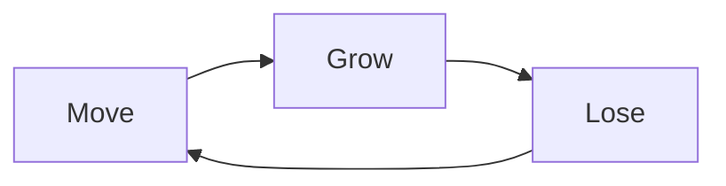

# GDD — loneliness

> **Genre:** narrative / meditative ascent
> **Platform:** PICO-8 (native + web export)
> **Target Audience:** players of short emotional indie works (Cart Life, Glitchhikers, Bernband); PICO-8 community; jam audience
> **Status:** Draft
> **Last Updated:** 2026-07-24

This GDD is a wiki — summaries with links to deeper docs in `.design-context/`. Full system designs, tuning tables, edge cases, and code-level detail live there.

---

## 1. Executive Summary

**Elevator Pitch:**

A meditation on irreversible attachment. You ascend a corridor without destination, calling to color-matched spirits who orbit your light and swell your music. A larger shadow casts a warning ring and takes them from you. Flowers offer new identities at the cost of severing your old bonds. The world scrolls down, pollen parts around you, and you cannot go back. The session ends when the story ends.

**Unique Selling Points:**

- Emotion is the only metric — no score, no fail, no win-condition number. Growth and loss are read in light radius and musical density.
- Show-don't-tell enforced inside gameplay: no tutorial text, no button prompts (one known conflict, deferred), no instruction. The world teaches by reacting.
- Ascent is literal and irreversible — the camera ratchets upward, bonds sever beyond reach, and the world that produced the player falls away permanently.

**Comparable Titles:**

Bernband, Glitchhikers, Cart Life (audience + tone); A Short Hike (ascent + non-violent loop); Outer Wilds (knowledge as currency instead of score).

---

## 2. Design Pillars

```
P1 — Always Move Forward
  Principle: The player only moves forward; there is no going back.
  Guides decisions: Ascent is literal and ratchet-locked — lost ground stays lost, lost bonds stay lost.
  Pushes against: Backtracking, lateral exploration, downward camera, do-overs for lost bonds.

P2 — Show, Don't Tell
  Principle: Never tell the player what to do; use UX, visual affordance, and gameplay behavior to guide them through.
  Guides decisions: Every encounter signals visually (call ring, attach chime, Big cast ring, flower particles). No tutorial text in gameplay.
  Pushes against: Tutorial text, button prompts, hint arrows, spoken instruction, system messages.

P3 — Emotion Is the Only Currency
  Principle: No score, no fail state, no progression metric competes with how the player feels.
  Guides decisions: Growth = light + music grow. Loss = light + music shrink. Identity shift = color change severs bonds. Every system feeds felt emotion.
  Pushes against: Score counter, leaderboard, fail/game-over screen, XP, achievements, session statistics, completion percentage.
```

Full pillar history + evolution: [`.design-context/pillars.md`](.design-context/pillars.md)

---

## 3. Core Loop



**Move:** Player ascends. Camera ratchets, world scrolls downward, pollen and grass parallax. Neutral input phase.

**Grow:** Player calls to a color-matching NPC. It bonds, orbits the player's light, glows wider, adds a music layer.

**Lose:** Bonds sever — Big NPC steals, color-change detaches mismatches, non-match NPCs flee, attached NPCs drift free beyond range. Glow shrinks, music layer drops, detach chime.

**Loop payload:** Emotional state delta — growth, then loss, then movement into the next encounter. No goal node.

**Secondary Loops:**

- Identity loop (flower): hold to change color → mismatched bonds flee + new matches become attractable. Discrete decision events, finite per session.
- Ambient loop (pollen): world reacts to player presence + Big cast + flower burst. Pure visual, no state feedback.

**Meta Loop:** Single session narrative arc → ending beat (design TBD). No cross-session progression.

**Pacing:** NPC matching is common; Big + flower are rare. Common grows, rare losses and shifts punctuate. Intensity curve defined by entity placement along the ascent.

Full loop history: [`.design-context/core-loop.md`](.design-context/core-loop.md)

---

## 4. Player Journey

**First 5 Minutes:**

Splash logo → intro typewriter title → dithered fade-in reveals play. Player wakes in a corridor with a white glow, sees one matching NPC within reach, no instruction. Pressing movement buttons, the player learns they ascend. Experimentation with the call button produces a wave and the first attach — glow widens, music adds a layer, chime plays. The player understands the bond verb immediately through visual response.

**First 15 Minutes:**

Two or three matching NPCs orbit. A non-matching NPC enters view; contact makes it flee. Big NPC enters, casts a warning ring, steals one bond, retreats. Player feels loss: glow shrinks, music layer drops, detach chime. Recovery via next call-wave attach. First flower encountered: hold to change color, mismatched bonds flee, color-burst ring scatters pollen, new color's NPCs become attractable.

**First Hour:**

Player has cycled through colors, learned Big's behavior, learned color-change cost. Approaches the ending beat (TBD). In current scope without ending, player hits content boundary.

**Onboarding:**

- Tutorial approach: pure diegetic / show-don't-tell. No tutorial text in play.
- Known friction: call wave verb may be undiscovered if player doesn't experiment. Flower "hold x" prompt is an explicit tell and a known P2 conflict (T2/OQ3, deferred).
- How the game teaches: color matching via NPC appearance + player's own glow color. Attach via call ring + NPC snapping to orbit + chime. Flee via NPC despawn.

---

## 5. Feature Catalog

| # | Feature | Type | Pillar | Core Loop Phase | Status |
|---|---|---|---|---|---|
| 1 | Player Movement + Ratchet Camera | Core | P1/P2/P3 | Move | ✅ |
| 2 | Color-Matched NPC Attach (Call Wave) | Core | P1/P2/P3 | Grow + Lose | ⚠ — overflow guard open |
| 3 | Big NPC Thief | Core | P1/P2/P3 | Lose | ⚠ — idle drift TBD |
| 4 | Flower Color-Change | Core | P1/P2/P3 | Grow + Lose | ⚠ — mis-input guard TBD, prompt conflict deferred |
| 5 | Pollen Ambient | Secondary | P2/P3 | atmosphere | ⚠ — overflow paths open |
| 6 | Dynamic Soundtrack | Secondary | P2/P3 | display | ⚠ — musical ceiling vs unbounded glow |
| 7 | Grass & Flower Visual | Content | P1/P2/P3 | atmosphere | ⚠ — hardcoded grass removal TBD |
| 8 | Splash + Intro + Fade-In | Content | P1/P2/P3 | pre-play | ✅ |

Status: ✅ locked / ⚠ flag open / ❌ blocked.

---

## 6. Systems Design

*Each system has a full design doc in `.design-context/systems/`. This section is a summary + link. Code-level detail, tuning tables, edge cases, and pairwise interactions live in the system files.*

### System 1 — Player Movement + Ratchet Camera

Player moves freely within invisible corridor bounds; camera ratchets upward only, never back. This is the literal enforcement of P1 and the axle of the Move node. Every entity is world-space and scrolls downward as the player ascends — parallax pollen and grass sell the forward motion.

Full design: [`.design-context/systems/01-movement-camera.md`](.design-context/systems/01-movement-camera.md)

### System 2 — Color-Matched NPC Attach (Call Wave)

Player casts a radial wave; matching-color NPCs bond and orbit, non-matching NPCs flee. The primary "Grow" verb. Bonds detach beyond range — forward motion can't drag the past along.

Full design: [`.design-context/systems/02-call-wave-attach.md`](.design-context/systems/02-call-wave-attach.md)

### System 3 — Big NPC Thief

A larger 2x2 NPC that hunts attached bonds, casts a warning ring, plucks them one at a time, then retreats horizontally. The primary "Lose" agent — the only involuntary loss source besides color-change.

Full design: [`.design-context/systems/03-big-npc-thief.md`](.design-context/systems/03-big-npc-thief.md)

### System 4 — Flower Color-Change

Hold near an unused flower to shift the player's glow color. Mismatched attached NPCs sever and flee; new matching NPCs become attractable. Trade node between Grow and Lose — give up old bonds to enable new ones. Finite, single-use per flower.

Full design: [`.design-context/systems/04-flower-color-change.md`](.design-context/systems/04-flower-color-change.md)

### System 5 — Pollen Ambient

Ambient particles drift through the world, repelled by the player, pushed by Big's cast ring, scattered explosively by flower color-burst. Visual air — gives motion to the void and dramatizes the two loudest beats. No state, no score, no loop edge.

Full design: [`.design-context/systems/05-pollen-ambient.md`](.design-context/systems/05-pollen-ambient.md)

### System 6 — Dynamic Soundtrack

Music is the audible mirror of attachment. Bass plays alone at start. Layers join as bonds accrue, drop as bonds sever. The only displayed form of attachment count — felt, not counted. Whole-tone scale throughout.

Full design: [`.design-context/systems/06-dynamic-soundtrack.md`](.design-context/systems/06-dynamic-soundtrack.md)

### System 7 — Grass & Flower Visual

Static world dressing. Grass tufts anchor each NPC plant cluster visually; flowers share the two-pass draw pattern. With pollen parallax, drives the felt sense of upward motion. No interaction, no state.

Full design: [`.design-context/systems/07-grass-flower-visual.md`](.design-context/systems/07-grass-flower-visual.md)

### System 8 — Splash + Intro + Fade-In

First impression + narrative framing + transition choreography. Splash brands the studio. Intro types the title, holds, fades. Play opens with a dithered black overlay thinning over two seconds — the world appears through dissolving dark. Sets the emotional register before the first input.

Full design: [`.design-context/systems/08-splash-intro-fadein.md`](.design-context/systems/08-splash-intro-fadein.md)

---

## 7. Pairwise Interaction Matrix

Skipped per user. Deferred to design judge or Balance & Tuning phase if requested. Each system file has a pairwise status table tracking interactions with other systems.

---

## 8. Balance & Tuning

Tuning intent and relationships, not absolute numbers (numbers are placeholders — they change in balancing passes). Full tuning tables per system live in the system files.

**Movement + Camera:** Player speed is steady; camera ratchet tolerance controls how soon the world starts scrolling when the player enters the top zone. Corridor bounds are tight — the player feels walled.

**Call Wave:** Wave reach is shorter than detach range — a bond made at maximum reach is already near the edge of losing. Call cooldown prevents spam; the player commits to each cast. Orbit lerp is slow so attached NPCs trail heavily; clamp caps their speed so they never lunge.

**Big NPC:** Steal range is large enough to engage from across the screen; warning ring gives a window to react. Steal cadence is slow enough that one bond is lost at a time, not all at once. Grace period after attach means fresh bonds are safe briefly. Retreat is slow and horizontal — Big lingers as a fading threat.

**Flower:** Charge time is long enough to be a commitment, not a twitch. Interaction range is generous so the player doesn't have to be pixel-perfect. Burst strength is aggressive — pollen scatters dramatically on color change.

**Pollen:** Count is dense enough to feel like air, not sparse enough to feel decorative. Player repulsion radius is a small wake, not a shield. Respawn is slow after burst — the world visibly thins then refills.

**Soundtrack:** Layer thresholds map directly to attachment count. Bass alone at start, pad at first bond, melody at second, shimmer at third. Ceiling at three — four bonds and beyond sound no different from three, but glow continues growing visually.

---

## 9. Technical Requirements

**Platform Targets:**

- PICO-8 (native desktop, web export)
- Resolution 128×128, 16-color palette, 30fps target

**Engine:**

- PICO-8 v43 cart, single-file `.p8`
- Code in Lua section across 2 tabs: runtime state + systems on tab 0, level layout on tab 1

**Performance Targets:**

- 30fps steady with 60 pollen particles, glow flicker, Big onscreen, cast ring + burst ring simultaneously
- PICO-8 fixed-point cap: distance checks exceeding 181px on any axis overflow `dx*dx` and return 0 from `sqrt` — false-positive cross-map interactions. Mitigation is a pre-check guard before every world-space `sqrt`. Already applied in Big + flower; needs propagation to call wave and 3 pollen paths (see code change queue).

**Memory Budgets:**

- PICO-8 Lua token limit: 8192 default
- PICO-8 map RAM: unused — corridor is procedural, no map data
- Sprite RAM: spritesheet used
- Music: 8 patterns × 4 channels, 3 SFX slots

**Networking:** None.

**Build Pipeline:**

- PICO-8 editor → reload cart → run (Ctrl+R reruns loaded cart, does NOT reload from disk — must reload after external edits)
- Web export via PICO-8 export command
- Level layout: `level_editor.html` external tool → exports Lua for tab 1

---

## 10. Production & Scope

**Team Size:** 1 designer/developer + AI assistant

**Estimated Timeline:**

- Cart feature-complete (current scope). GDD post-hoc.
- Remaining: ending beat design, code-change cleanup, level-editor validation, Narrative Event lock mechanic.

**Feature Priority:**

- **Must-have:** Ending beat (narrative game, ending required).
- **Should-have:** Code cleanup (overflow guards, mis-input guard, hardcoded grass removal, Big idle drift).
- **Nice-to-have:** Narrative Event lock mechanic, level-editor validation, Pairwise Matrix, formal Balance & Tuning pass.

**Risk Register:**

| Risk | Likelihood | Impact | Mitigation |
|---|---|---|---|
| Overflow bug in unguarded distance checks | Med | Med | Pre-check guard pattern — already applied in Big/flower, needs propagation. |
| Big idle forever (player skirts range) | Med | Low-Med | Big idle drift toward side walls — designed, code TBD. |
| Big + flower dual-loss tension | Low | Low | Level-editor constraint: no flower within Big range. Editor validation TBD. |
| Ending beat not yet designed | High | High | OQ4 design process next. |
| Musical ceiling at 3 while glow grows unbounded | Med | Low | Design acceptance or retune layer threshold. |
| Flower prompt P2 conflict | High | Med | Replace with visual affordance. OQ3 deferred. |

---

## 11. Appendices

**Open Questions:** [`.design-context/open-questions.md`](.design-context/open-questions.md) — 8 open, 1 resolved.

**Code Change Queue:** [`.design-context/code-change-queue.md`](.design-context/code-change-queue.md) — design decisions made, awaiting implementation.

**Design Log:** [`.design-context/design-log.md`](.design-context/design-log.md) — every decision + rationale.

**Tensions:** [`.design-context/tensions.md`](.design-context/tensions.md) — 2 active, 2 resolved.

**Rejected Ideas:** [`.design-context/rejected-ideas.md`](.design-context/rejected-ideas.md)

**References:**

- `loneliness.p8` — the cart
- `.claude/devlog.md` — chronological feature log
- `.claude/skills/loneliness/SKILL.md` — cart conventions
- `level_editor.html` — visual layout tool
- `.design-context/systems/` — full system designs (this GDD condenses them)